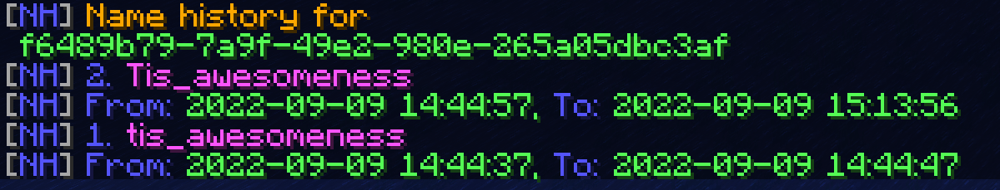

# NameHistorian

Records and displays player name changes over time.

**Minecraft Version:** 1.8 - 1.20.6

## Commands

### `/history <player>`

Looks up and displays the name history of a player. Supports both usernames and UUIDs. If the player is offline, also requests their current profile from the Mojang servers and saves it.

**Permission:** `namehistorian.history` (default: op)

### `/namehistorian reload`

Reloads the config and translations.

**Permission:** `namehistorian.reload` (default: op)

## Translations

To change the plugin's messages, go to the `plugins/NameHistorian/translations` folder and edit the `en.properties` file.

To add a new language, create a new `<locale_id>.properties` file.

- For example, use `es.properties` for Spanish, or `pt_BR.properties` for Portuguese (Brazil).
- A list of locale IDs can be found [here](https://www.localeplanet.com/java/).

Edit `config.yml` to change the default language or to toggle per-player translations.

## Building

To build NameHistorian, run `gradlew build`. The output jars are in the `build/libs` directory.
